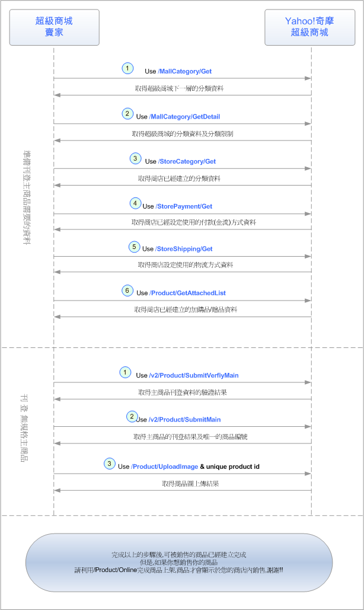
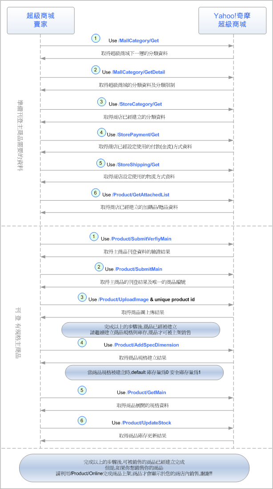
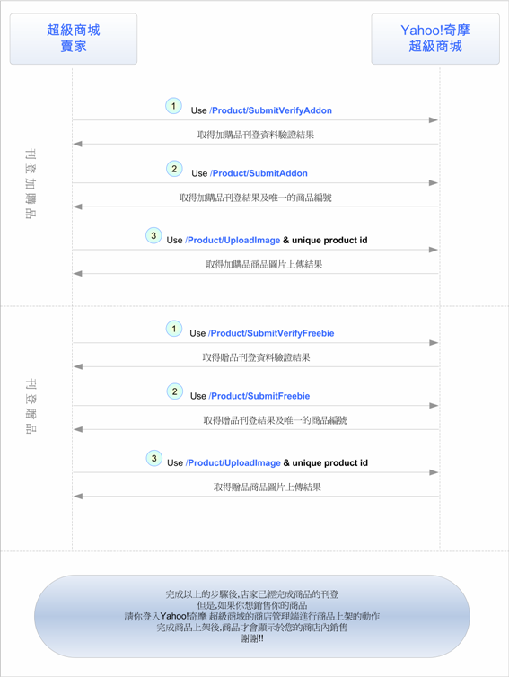
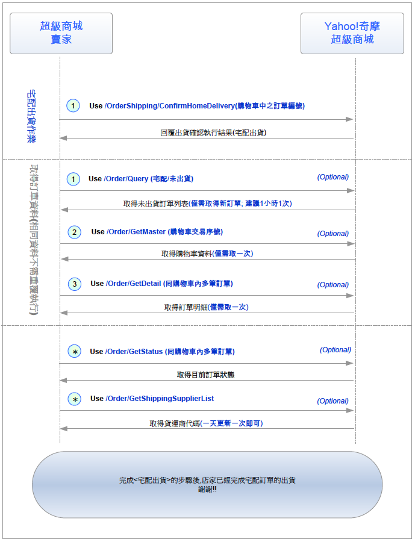
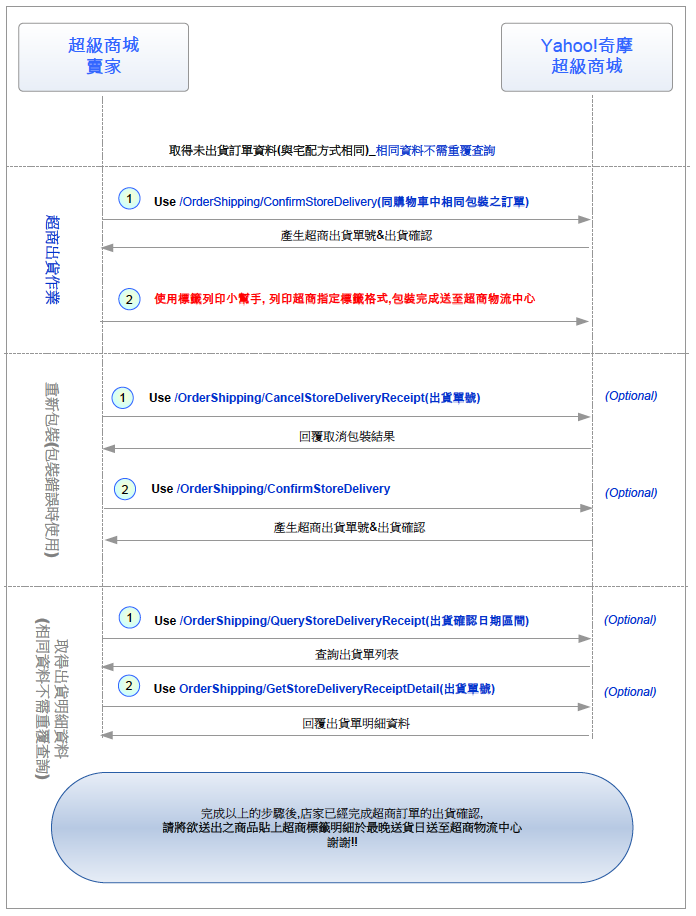
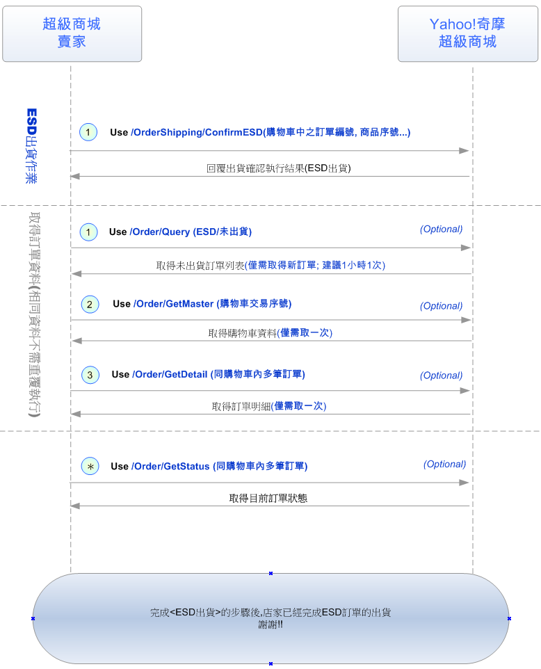
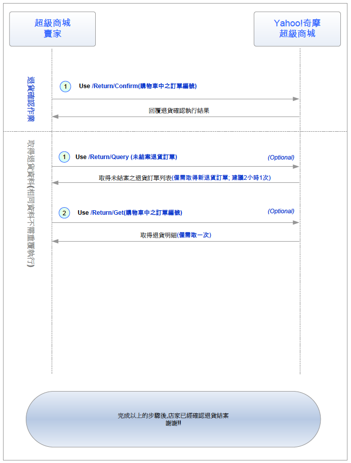
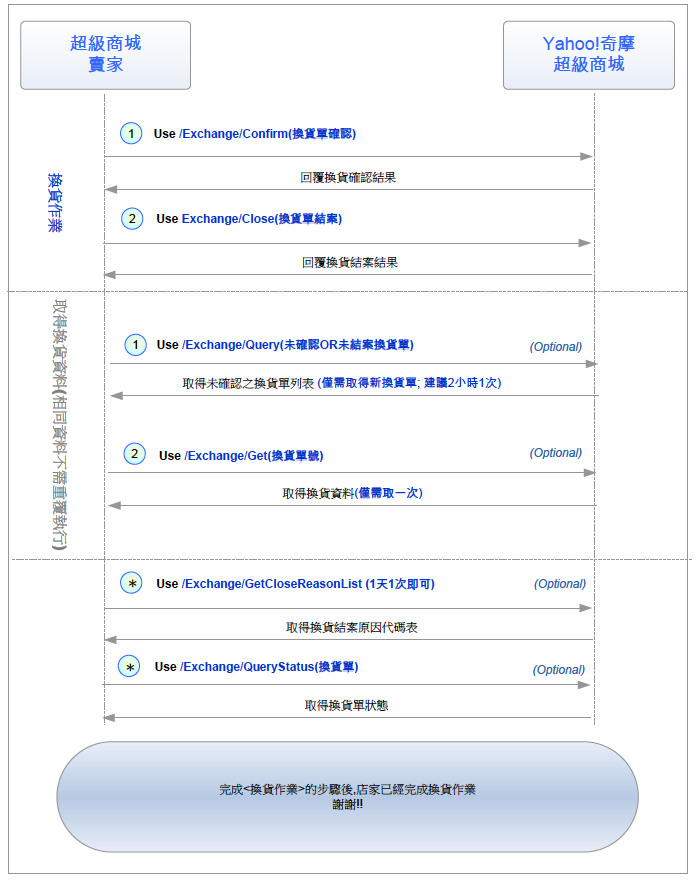
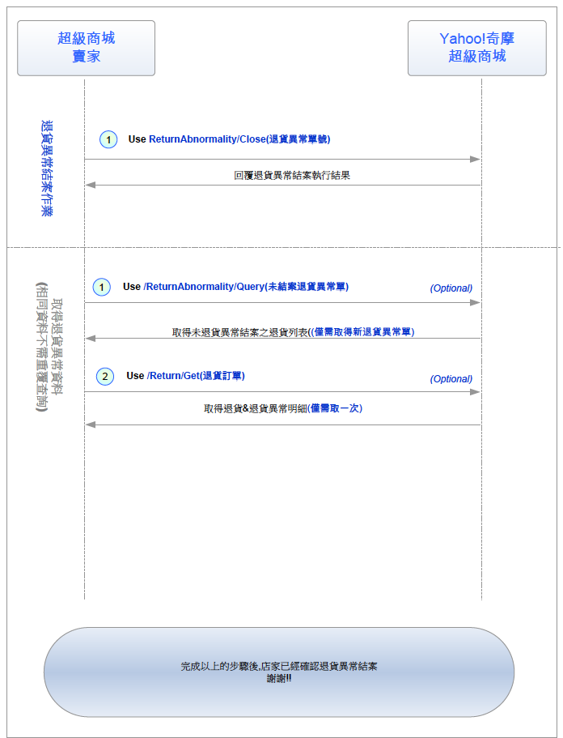

API Flow
========

Product
-------

### 刊登無規格主商品 API flow

以下為刊登「**無規格**」主商品時，API的使用流程：

建議您可以以這樣的步驟來使用超級商城提供的API

### 刊登有規格主商品 API Flow

以下為刊登「**有規格**」主商品時，API的使用流程：

建議您可以以這樣的步驟來使用超級商城提供的API

### 刊登加購品/贈品 API Flow

以下為刊登加購品/贈品時，API的使用流程：

建議您可以以這樣的步驟來使用超級商城提供的API

Order
-----

### 宅配訂單出貨 API flow

以下為處理宅配訂單出貨時，API的使用流程：

建議您可以以這樣的步驟來使用超級商城提供的API

### 超商訂單出貨 API Flow

以下為處理超商宅配訂單出貨時，API的使用流程：

建議您可以以這樣的步驟來使用超級商城提供的API

### ESD訂單出貨 API Flow

以下為處理ESD訂單出貨時，API的使用流程：

建議您可以以這樣的步驟來使用超級商城提供的API

### 退貨 API flow

以下為處理退貨時，API的使用流程：

建議您可以以這樣的步驟來使用超級商城提供的API

### 換貨 API flow

以下為處理換貨時，API的使用流程：

建議您可以以這樣的步驟來使用超級商城提供的API

### 退貨異常 API Flow

以下為處理退貨異常時，API的使用流程：

建議您可以以這樣的步驟來使用超級商城提供的API

