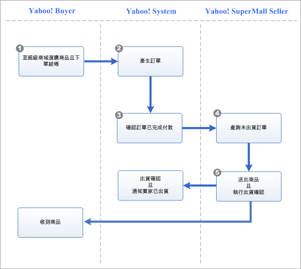
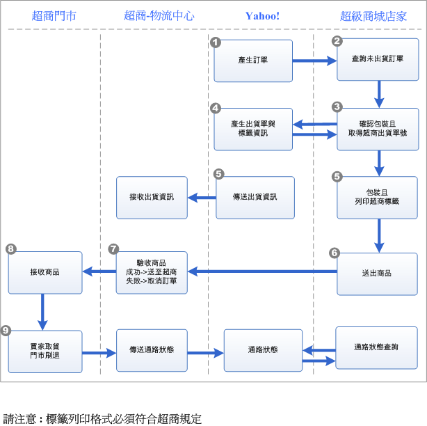
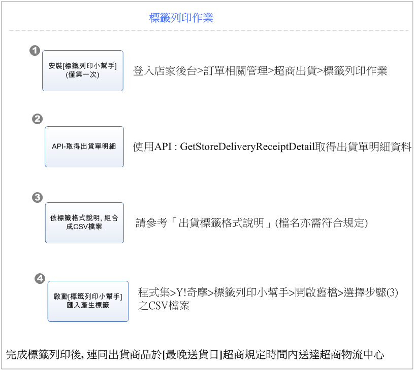
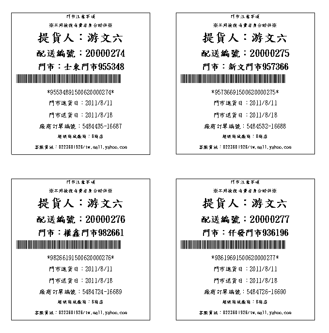
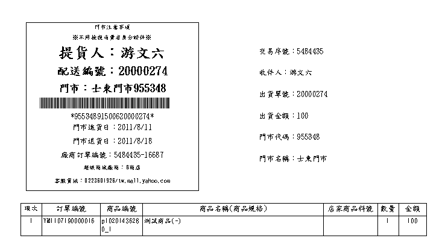
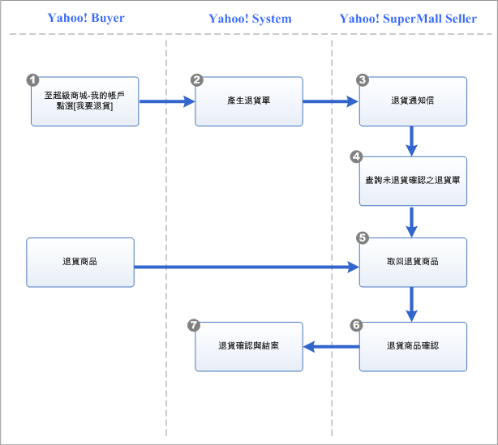
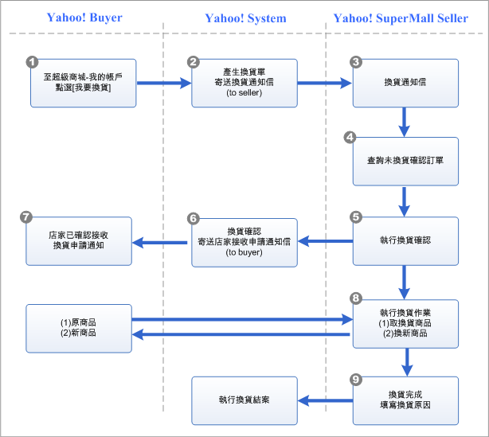

作業流程
========

Order相關作業流程
-----------------

## 宅配出貨

## 超商出貨

## 超商標籤列印

1.  標籤列印小幫手

    請登入超級商城管理端下載標籤列印小幫手，來協助您完成標籤套印

2.  取得出貨單明細

    利用API /OrderShipping/GetStoreDeliveryReceiptDetail 取得超商出貨單明細資料

3.  依標籤格式說明,組合成CSV檔

    請下載[出貨標籤格式說明.pdf](images/LabelIntroduce.pdf)，此檔案中說明了超商標籤的格式與如何組成標籤列印小幫手所需的CSV檔。將透過/OrderShipping/GetStoreDeliveryReceiptDetail所取得的出貨單明細資料組成標籤列印小幫手所需的CSV檔，就能利用標籤列印小幫手列印出符合超商驗收規格的標籤。
    -   出貨標籤CSV範例檔：[Ps711Label\_20110809.csv](images/Ps711Label_20110809.csv)
    -   出貨標籤(含出貨單)CSV範例檔：[Ps711LabelDetail\_20110809.csv](images/Ps711LabelDetail_20110809.csv)

4.  啓動\[標籤列印小幫手\]匯入產生標籤

    標籤格式分為兩種

    -   超商出貨標籤：提供超商出貨所需的標籤格式
        
    -   超商出貨標籤(含出貨單)：除了提供超商出貨所需的標籤格式外，還包含了出貨單的資料
        

5.  注意事項

    此為【物流交寄】方式，【門市交寄】方式請至門市或店家後台&gt;超商出貨&gt;門市交寄相關作業執行列印

## 退貨

## 換貨

